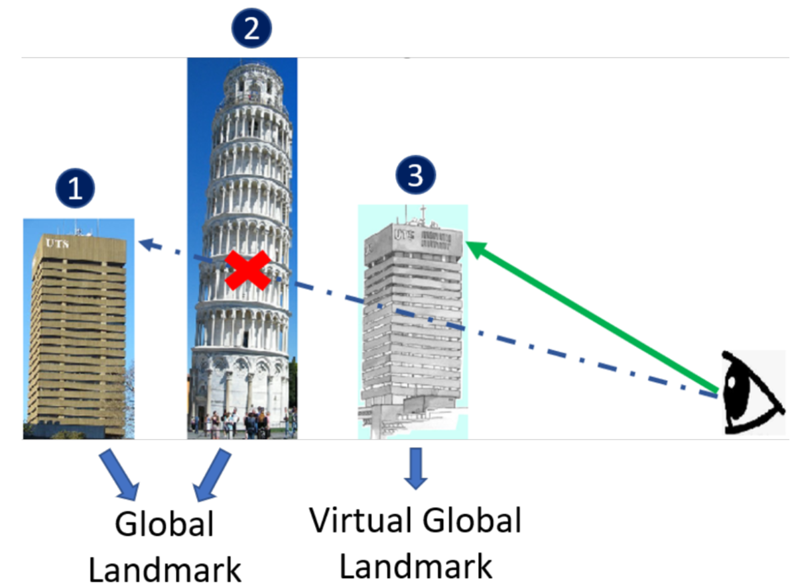
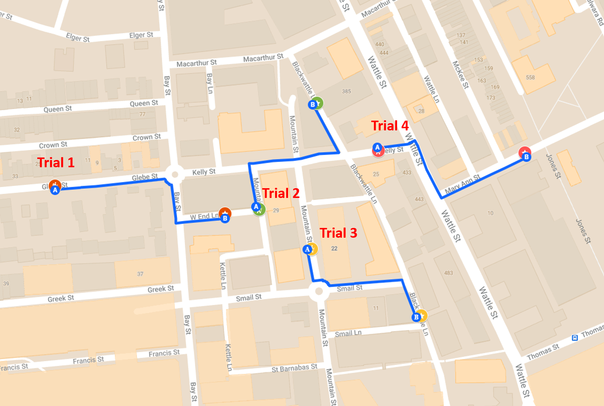
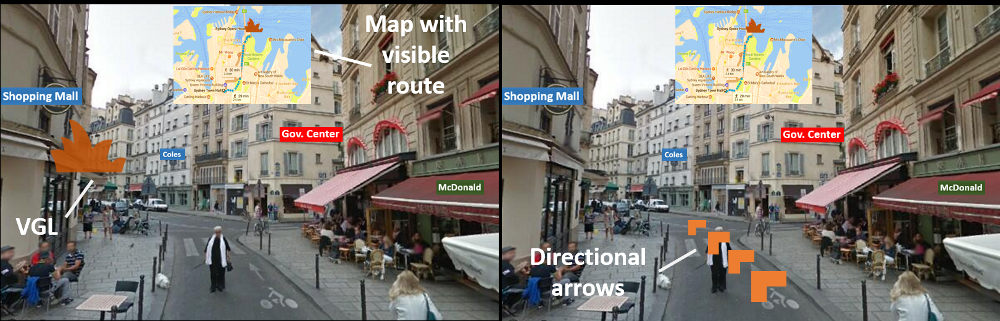
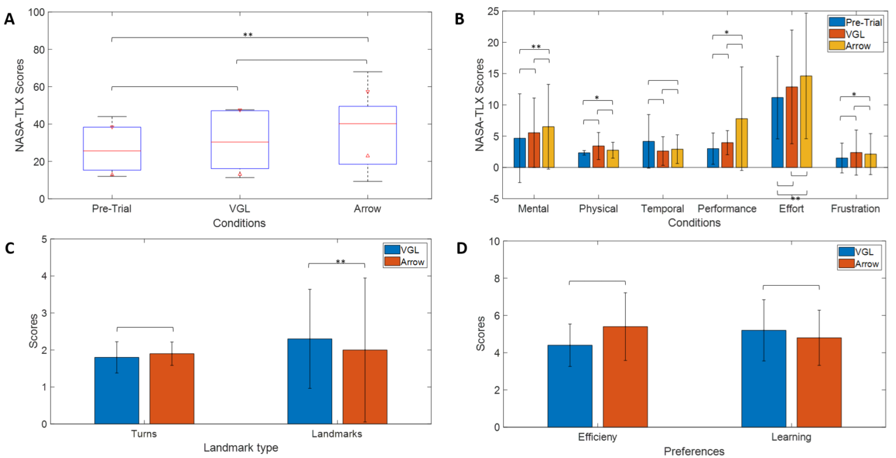

#  バーチャルグローバルランドマーク： 空間ナビゲーション学習向上のためのAR(拡張現実)技術

## 概要

​		ナビゲーションは、複雑な認知機能を含む多面的な人間の能力です。これにより、よく知られた空間を効率的に移動できると同時に、道に迷うことなく未知の環境を積極的に探索できるようになります。しかし、ナビゲーション支援システムへの依存度が高まると、周囲環境の処理が低下し、空間知識の獲得、ひいては方向認識能力が低下します。 Google マップのような現在のナビゲーション支援システムによって引き起こされるこのようなスキルの損失を防ぐために、私たちは拡張現実 (AR) における新しいランドマーク技術である仮想グローバル ランドマーク (VGL) を提案します。この技術は、ナビゲーションを支援し、空間学習を促進することを目的としています。私たちは 5 人の参加者を対象にパイロットスタディを実施し、方向矢印と VGL を比較しました。私たちの結果は、参加者は、精神的負荷を大幅に増加させることなく、方向矢印よりも VGL を使用したナビゲーション中に環境についてより多くのことを学習したことを示唆しています。この結果は、当社のナビゲーション システムの将来に大きな影響を与えます。

## 1 はじめに

​		空間ナビゲーションは、空間情報を使用して未知の環境を探索し、目的地までのルートを決定するプロセスです。空間ナビゲーションと方向指示の能力は、すべての生物にとって重要であることがよく認識されています [1]。人間によるナビゲーションのサポートについては、Google マップ ¹、Bing マップ ²、Apple マップ ¹ などの一般的なナビゲーション支援システムが、日常のナビゲーションにおける効率的な自動方向指示によって私たちに恩恵をもたらしていることに疑いの余地はありません。しかし、これらのナビゲーション サポートの使用量が増えると、周囲環境の処理が減少し、空間知識の獲得が低下する可能性があります。したがって、これらのシステムの使用は、ユーザーのナビゲーション能力の喪失につながります [4、11、16、17]。このような影響を克服するには、ユーザーが空間認識能力を高めるために周囲を認識できるように、オリエンテーション中に環境に関するより多くの手がかりが必要です。方向感覚とナビゲーションスキルの向上は、メンタルマップの数が増加するため、神経接続に直接影響します[10、13]。さらに、以前の研究 [2、6、15] では、ランドマークがナビゲーションと空間学習にプラスの効果をもたらす重要な環境の合図であることが示されています。

​		より優れたナビゲーション能力の利点を考慮すると、空間学習を改善するためのさまざまな技術がかなりの研究で発見されています。 2004 年に、Richter と Klippel [19] は、ル
ート指示の概念化と精神的処理を軽減するために、ルー
トの環境に基づいてルート指示を適応させるアプローチを
発表しました。その後、シュミットら。 [20] は、Richter らと同様のルート認識マップを生成する技術を開発しました。周囲の環境をよりよく理解するのに役立ちます。最近、Li ら [12]は、方向感覚が鈍い人々が空間方向を認識できるようにす
る、空間方向のサポートのために遠くのランドマークを視
覚化するモバイル マップ ディスプレイを提案しました。

​		ただし、これらのテクニックは学習には役立ちますが、2 次元画面でのプレゼンテーションのため、特定の基準フレームの傾向を持つ人にのみ役立ちます [7] 。 最近の研究では、仮想現実 (VR) 環境内での空間学習を強化するランドマーク キューの利点について、さらに豊富な証拠が示されています [3、5、14、23]。 これらの作品は、ポータブルで強力でウェアラブルな拡張現実 (AR) 技術 [21] の最近の重要な開発の助けを借りて、方向性サポートの新しいパラダイムを開きます。 AR テクノロジーを使用すると、ユーザーはデジタル情報を使用して普及したコンピューティング環境と自然に対話できるようになります [18]。

​		現在の AR テクノロジーでは、現実世界に矢印やパスなどのナビゲーション アイコンを配置するために使用できるデジタル情報を表示できます。このシームレスな統合により、混乱や不快感を引き起こすことなく、ユーザーの方向性と空間ナビゲーション能力を向上させることができます。これは、空間知識の獲得と神経処理の新しい方法につながる可能性があります。ただし、現在の AR ベースのナビゲーションは、ユーザーに見えるランドマークのオーバーレイのみに焦点を当てています。このオーバーレイは、ユーザーの注意を引くことを目的としており、ナビゲーションを支援することを目的としたものではありません。

​		地球規模のランドマークを参照として使用することは、未知のエリアをナビゲートするためのよく知られた方法です。たとえば、オーストラリアのシドニーにあるシドニー オペラ ハウスを参考にしてナビゲーションの道順を誰かに教えることは、地元の他のランドマークに関して同じナビゲーションの道順を説明するよりも役立ちます。空間ナビゲーション能力における地球規模のランドマークのこのプラスの効果を動機として、我々は、AR ベースのナビゲーション システム用の新しいランドマーク表示スキーマである仮想地球ランドマーク (VGL) を提案します。私たちの貢献は次のとおりです。

1. 新しい仮想地球ランドマーク (VGL) 技術により、たとえ周囲の障害物であっても地球規模のランドマークを見ることができます。この可視性の更新により、ユーザーは自然なナビゲーション スキルへ
   の干渉を最小限に抑えながら、VGL を基準点として使用できるようになります。
2.  VGL はユーザーの空間学習の改善に貢献でき、これは記憶喪失などの長期的な神経学的問題を防ぐために不可欠であることが示されています [13]。
3. VGL をナビゲーション技術として使用した AR ベースのナビゲーション システムのプロトタイプ。

## 2 材料と方法

### 2.1 参加者
​		実験は5人の参加者に対して行われ、全員が男性でした。参加者の平均年齢は29歳で、範囲は26～33歳でした。研究に参加する前に、各参加者には実験手順の十分な説明が与えられ、インフォームドコンセントが得られました。倫理の承認は、オーストラリアのシドニー工科大学の人間研究倫理委員会によって発行されました。実験は現実世界の環境で行われました。参加者の中には実験結果に影響を与えた可能性のある精神疾患の既往歴がなかった。

### 2.2 AR設定

​		AR アプリケーションは、HoloLens 1 (Microsoft Corp. 米国) デバイス上で実行されるように構築されました。 このデバイスの視野は 30X17.5° です。 参加者の頭の方向は、HoloLens 内の内蔵慣性測定ユニット (IMU) と環境理解カメラを使用して計算されました。 AR アプリケーションは Unity 3D ゲーム エンジンを使用して構築されました.

​		HoloLens システムには全地球測位システム (GPS) がないため、ユーザーの位置情報を提供するために携帯電話が使用されました。この目的には、Android オペレーティング システムを実行する携帯電話 (Samsung Galaxy A31) が使用されました。携帯電話のGPS 位置が変化するたびにユーザーの位置を AR システムに報告するカスタム アプリを開発しました。これを実現するために、Location5の更新が Google Firebase 5 データベースに送信され、その情報が HoloLens デバイスに送信されました。

### 2.3 仮想世界ランドマーク
​		VGL は、世界のランドマークを仮想的に表現するための方向補助です。この実験では、シドニーのオペラハウスとシドニー工科大学の主要タワービルが世界的なランドマークとして使用されました。オペラハウスとタワービルの仮想オーバーレイ画像は、実際の視野角と位置で表示されました。実際のランドマークが見えない場合、VGL が参加者に見えるようになります。これは、提示された作品内の距離に基づいて決定されます。図 1 を参照してください。

**図 1: VGL の説明: (1) 実際のグローバル ランドマーク、(2) 別のランドマークが最初のランドマークを隠している、(3) 視界内にある最初のランドマークの VGL 表現ランドマークの方向。**

### 2.4 VGLの開発

​		参加者に VGL を表示するために、参加者と各実際のランドマークの間の方向ベクトル vgl が計算されました。すべての地理計算には地理位置情報 API Mapbox 6 が使用されました。 VGL を参加者から VGL の方向に1 メートルの距離に配置しました。 VGL は常に参加者の視界の高さに設置されました。

​		VGL は、参加者に実際のランドマークの方向に配置された浮遊ホログラムを見ているような感覚を与えることを目的としています。 そのため、各 VGL では、各建物の輪郭を示す単純な 2D 図面が使用されました。 参加者の注意を引くために赤く着色され、ホログラムのような雰囲気を与えるために 80% の透明度が設定されました。 VGL は 2D 描画であるため、VGL の前方ベクトルが常に参加者の方を向くようにしました。 そうすることで、どの角度から見ても VGL が常に見えるようになりました。

### 2.5 実験シナリオ

​		この実験は、図 2 に示す 4 つの事前定義されたナビゲーション トライアルで構成されます。各トライアルは、出発点と目的地 (図 2 で A および B とマーク) で構成されます。トライアルを正常に完了するには、各参加者は出発点 A から目的地 B まで移動する必要があります。参加者は HoloLensデバイスの助けを借りて移動し、実験者は中断されることなく 0.5 メートル以内の距離を後ろから歩きました。参加者が目的地から 10 メートル以内に近づくと、HoloLensシステムは「目的地に到達しました」というメッセージを表示します。このメッセージは裁判の終了を告げるものでした。この後、実験者は参加者を新しい実験の次の開始点に連れて行きました。参加者には、通常の航行状況と同様に、歩行中に交通や人を避けて自然に歩くように指示されました。

**図 2: 各参加者の各トライアルで使用されるナビゲーション ルート。ここに示されている地図は、オーストラリア、ニューサウスウェールズ州シドニーのグリーブとウルティモの郊外を示しています。ルートの始点は A、目的地は B で表されます。**

**図 3: 実験デザイン: (左) 実験は、中央に地図を備えたナビゲーション用の VGL で構成されています。 (右) トライアルは、中央に地図を備えたナビゲーション用の方向矢印で構成されています。この図は、VGL と方向矢印の違いを説明するための説明のみを目的としています。**

​		アウト ナビゲーション システムには、方向矢印と VGL という 2 つのナビゲーション補助機能が含まれています。各トライアルで、参加者はそれらのうちの 1 つだけを使用してナビゲーションしました。方法論はランダムに割り当てられ、「方向矢印」の 2 つのトライアルと「VGL」の 2 つのトライアルになりました。これらのテクニックに加えて、ユーザーには常に、出発点、目的地、たどるべき推奨ルート、およびユーザーの現在位置を示す地図が表示されました。図 3 は、ユーザーの視点から見た AR 画面のセットアップを示しています。すべての参加者は、必要に応じてこの地図を参考として使用するように指示されました。ナビゲーションを試行するたびに、ユーザーは約 350 メートルの距離を歩きました。各試行には平均して約 7 分かかりました。

### 2.6 アンケート

​		ナビゲーションのトライアルを開始する前に、各参加者に 2 つの 7 点リッカート尺度ベースのアンケートに回答するよう依頼しました。最初のアンケートは NASA-TLX [8] 作業負荷アンケートでした。このアンケートには、実験を開始する前に参加者の精神的作業負荷のレベルを理解するための 7 つの質問が含まれています 。 NASA-TLX アンケートの後には、サンタバーバラ方向感覚 (SBSOD) スケール [9] に基づく 7 ポイントのリッカート スケールが続きます。これには、参加者のナビゲーション スキルを理解するための 15 の質問が含まれています。 SBSOD を収集しましたが、さらなる分析には使用しなかったことに注意してください。

​		NASA-TLX は各試験の最後にも質問されました。私たちは、さまざまなナビゲーション補助 (方向矢印または VGL) によって参加者の作業負荷レベルが変化したかどうかを理解したいと考えました。また、各実験の間に、各参加者に全体のナビゲーション ルートを描くように依頼しました。私たちは彼らに、店舗、奇妙な家、ユニークな木など、重要だと考えるランドマークを指定するよう依頼しました。実験の最後に、参加者に「方向矢印」と「VGL」のどちらを好むかについてのアンケートに答えてもらいました。すべてのナビゲーション試行、アンケート、地図描画を含めて、実験を完了するには全体的に約 1 時間かかりました。

### 2.7 統計

​		NASA-TLX の序数尺度、地図描画、好みのアンケートのため、ノンパラメトリック Wilcoxon 符号付き順位検定[22] を 10% の有意水準で使用してデータを分析しました。この研究ではサンプルサイズが非常に小さいため、10% の有意水準を適用しました。

### 2.8 仮説

この実験を実施する目的は、従来のナビゲーション手段 (方向矢印) と比較して VGL の有効性を評価することです。私たちは、VGL が方向矢印と比較して、ユーザーの空間学習と環境に対する認識を向上させることができると信じています。そこで、次のような仮説を立てました。

- H1: ユーザーは、VGL を使用するために方向矢印よりも高い認知努力を必要とする場合があります。したがって、VGL トライアルでは、方向矢印トライアルよりも高い精神的負荷がかかります。
- H2: 参加者は、方向矢印と比較して、VGL を使用したナビゲーション中に空間認識が向上します。

**図 4: NASA-TLX、地図描画、および「方向矢印」または「VGL」に対する参加者の好みからのアンケート結果: A) 試験前、VGL、および方向矢印の精神的作業負荷を表す全体的な NASA-TLX スコア矢印の状態。 B) 独立したコンポーネントは、試行前、VGL、方向矢印条件に NASA-TLX を使用して全体的な精神的作業負荷に貢献しました。 C) 正しい曲がり角の数と正しく識別されたランドマークの数を描いた地図に基づく、VGL および方向矢印トライアルの合計スコア。D) 効率性/使いやすさ、およびナビゲーション環境についての学習に対する有効性に基づく VGL および方向矢印に対する参加者の好み (*: p < .10、: p < .05*:p < .01) 。**

## 3 結果と考察

​		NASA-TLX、地図描画、および個人的な好みからの結果を図 4 に示します。ナビゲーション中の精神的負荷: 図 4 (A) に示すように、全体的な精神的負荷は VGL トライアルと方向矢印トライアルの両方でわずかに増加しました。しかし、VGL 試験では、方向性矢印試験と比較して、精神的作業負荷は低いものの、統計的に有意ではありませんでした (p >0.05)。これは、方向矢印を使用するときにユーザーに必要な 2 つのアクションが原因である可能性があります。まず、方向矢印の位置を特定する必要があります。次に、矢印がどこを指しているのかを識別する必要があります。 VGL トライアルの場合、参加者は VGL の位置と比較して目的地の方向を確認するだけで済みました。したがって、精神的な作業負荷は方向矢印よりも低いことがわかりました。

​		方向矢印に対する精神的作業負荷は、実験前および試験アンケートと比較して有意に高いことが判明した (p<0.05)。私たちは、参加者全員が HoloLens デバイスの使用経験がなかったため、このようなことが起こったと考えています。私たちは、デバイスに慣れることで、すべての参加者に追加の精神的負荷が生じたと考えています。 VGL と方向矢印の間のこれらの結果は、方向矢印と比較して VGL が環境を処理して方向を見つけるためにより高い認知作業負荷を必要とする可能性があるという仮説 H1 を支持しません。各参加者の詳細なスコアは補足表 1 に示されています。

​		図 4 (B) は、精神的作業負荷に寄与する個々のコンポーネントを示しています。 VGL 試験と比較して、方向矢印試験では参加者がより高い精神的要求、パフォーマンス、努力を要求したことがわかります (p>0.05)。しかし、方向矢印トライアルは、トライアル前の条件と比較して、統計的に有意に高い精神的要求(p<0.10)、パフォーマンス (p<0.10)、および努力 (p<0.05) の要求を誘発します。 VGL はまた、より高い精神的要求、パフォーマンス、努力を誘発しましたが、これらの要素は統計的に有意ではありませんでした (p>0.10)。興味深いことに、試行前の時間的要求は VGL および方向矢印試行よりも高かったが、結果は統計的に有意ではなかった (p>0.10)。差が有意ではなかった理由の 1 つは、参加者が試験を完了するため、または時間通りに特定の場所に到着するための時間的プレッシャーがなかったことである可能性があります。

​		我々の結果は、VGL トライアルでは、トライアル前 (p>0.10) や方向矢印条件 (p>0.10) と比較して、より多くの身体的要求 (p>0.10)が必要となり、より高いレベルのフラストレーションを引き起こしたことを示しています。同様に、方向矢印のトライアルでは、身体的要求とフラストレーションのレベルが著しく高い (p<0.10) ことがわかりました。タスクの要求自体が目的地を見つけるのに多大な肉体的労力を必要とするため、これは明らかであることがわかりました。場合によっては、このタスクでは正しい位置を正しく判断できず、参加者に不満が生じました。興味深いことに、物理的な要求とフラストレーションは、方向矢印と比較して VGL の方が高かったです。考えられる理由の 1 つは、VGL に関して再配置し、その後目的地を見つけるために物理的な労力がさらに必要になることです。繰り返しになりますが、これらの結果は仮説 H1 を部分的に支持しておらず、方向矢印よりも VGL の認知作業負荷が高いことを示唆しています。また、各参加者の満点については補足表 2 を参照してください。

​		空間学習: 私たちの結果は、精神的ワークロードの結果に続く VGL と方向矢印条件の間の空間認識に関する仮説 H2 を裏付けています。 図４（Ｃ）に示すように、ＶＧＬトライアルでは、方向性矢印トライアルと比較して、参加者が有意にｐ＜０．０５）多くのランドマークを記憶することができたことは明らかである。 これらの結果は私たちの仮説 H2 を直接裏付けており、方向矢印などの従来のナビゲーション手段と比較して、VGL 支援ナビゲーションが参加者に空間認識を促すことを示唆しています。 矢印などの従来のナビゲーション支援補助具は、目的地を正確に見つけるのに役立ちました。 しかし、ユーザーは周囲の環境からの情報を処理することを思いとどまりました。

​		興味深いことに、VGL トライアルと方向矢印トライアルの両方で、参加者が思い出したターン数はほぼ同様 (p>0.10) でした。明らかな理由の 1 つは、ほとんどの場合 2 つの曲がり角で構成されるルートの長さです。したがって、ほぼすべての参加者が、トライアル終了時の地図描画タスク中にそれらを正しく描くことができました。ターンの合計数とランドマークの数は、補足表 3 に示されています。

​		学習と使いやすさに関する好み: NASA-TLX と地図描画を使用して VGL と方向矢印の長所と短所を評価した後、参加者に VGL と方向矢印の好みを評価するよう依頼しました。ユーザーは、効率性/使いやすさ、および空間認識能力の 2 段階評価でテクニックを評価しました。図 4 (D) に示すように、効率/使いやすさの観点から、参加者は常に VGL よりも方向矢印を好みます (p>0.10)。補足表 4 も参照してください。ユーザーは、方向矢印がわかりやすく、目的地に到達するときに役立つと感じています。一方、ユーザーは、VGL には追加の労力が必要であることに気づきました。そのため、参加者は VGL よりも方向矢印を好みました。しかし、空間学習の問題に関しては、参加者は VGL を選択し、これも仮説 H2 と一致しました。VGL は確かに空間学習に役立ち、それは地図描画の結果からも裏付けられています。参加者の評価は補足表 4 に示されています。

この研究では、VGL がナビゲーション能力の向上に役立つことが示されましたが、この研究には次のようないくつかの制限があることがわかりました。

1. 現在の研究の参加者の数はわずか 5 人であり、私たちの主張を確固たるものにするのに十分な統計的検出力を得るには少なすぎます。将来的には、より良い結論を裏付ける十分な力を得るために、多数の参加者を対象にこの研究を拡張する予定です。
2. 屋外で動作するように設計されていない HoloLens バージョン 1 を使用しました。したがって、地図、方向矢印、および VGL を視覚化するときに重大な問題が見つかりました。そのため、HoloLensでの視認性を高めるために、すべての実験を曇りの日に行う必要がありました。将来的には、このような問題を回避するために、HoloLens からより優れた AR ナビゲーション デバイスに移行したいと考えています。
3. また、歩行中の地図、矢印、VGL のジッタリングなど、視覚化に関する他の問題にも直面しました。これは参加者にとってイライラすることもありました。将来的には、Hololens 2 と同様の視線追跡テクノロジーを使用して、このような問題を確実に回避する予定です。
4. 発表された作品は参加者の主観的な評価に大きく依存しており、事実情報を誤って伝える可能性があります。将来的には、脳波（EEG）、心拍数変動（HRV）、瞳孔サイズなどの生理学的測定値を、精神的負荷と学習能力の測定値として使用して、VGLと方向矢印のパフォーマンスを評価および評価する予定です。客観的に。

## 4 結論

​		この研究により、VGL として知られる世界的なランドマークを表現する独自の AR 技術が開発され、空間学習の改善が見られました。私たちは、従来の方向矢印ベースのナビゲーション補助装置と新しい VGL 技術を比較する実世界の研究を設計しました。そのために、参加者は方向矢印または VGL を使用して4 つの事前定義されたルートをナビゲートするように求められ、次に NASA-TLX に答え、ナビゲートされたルート マップを描画し、使いやすい学習設定を行うように求められました。結果は、方向矢印と比較して、VGL は空間学習を促進しながら、参加者に精神的負荷をあまり与えないことを示しています。

