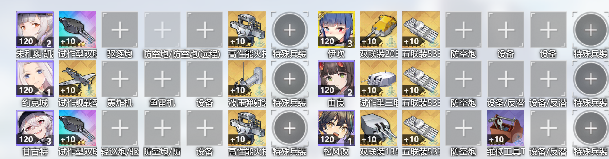

# 共斗建议

## 2025新年共斗
可前往[wiki](https://wiki.biligame.com/blhx/%E7%A2%A7%E8%93%9D%E6%B5%B7%E4%BA%8B%E5%B1%802025%E4%B8%9C%E7%85%8C%E6%98%A5%E8%8A%82%E6%B4%BB%E5%8A%A8%E4%B8%93%E9%A2%98)参考

困难满队刷经验，普通和简单低耗

=== "困难"
    
    !!! note
        要点，敌人为中甲，因此

        - 驱逐：，鱼雷随便，加个饭盒
        - 轻巡和重巡：随便带，死不了
        - 战列：
        
        
        ，加个火控
        - 航母：
        
        轰炸和鱼雷随便，不重要

=== "普通/简单"
    
    
    
    突击者+卡/唐，或者两个都带，最好的都带上，包不死的