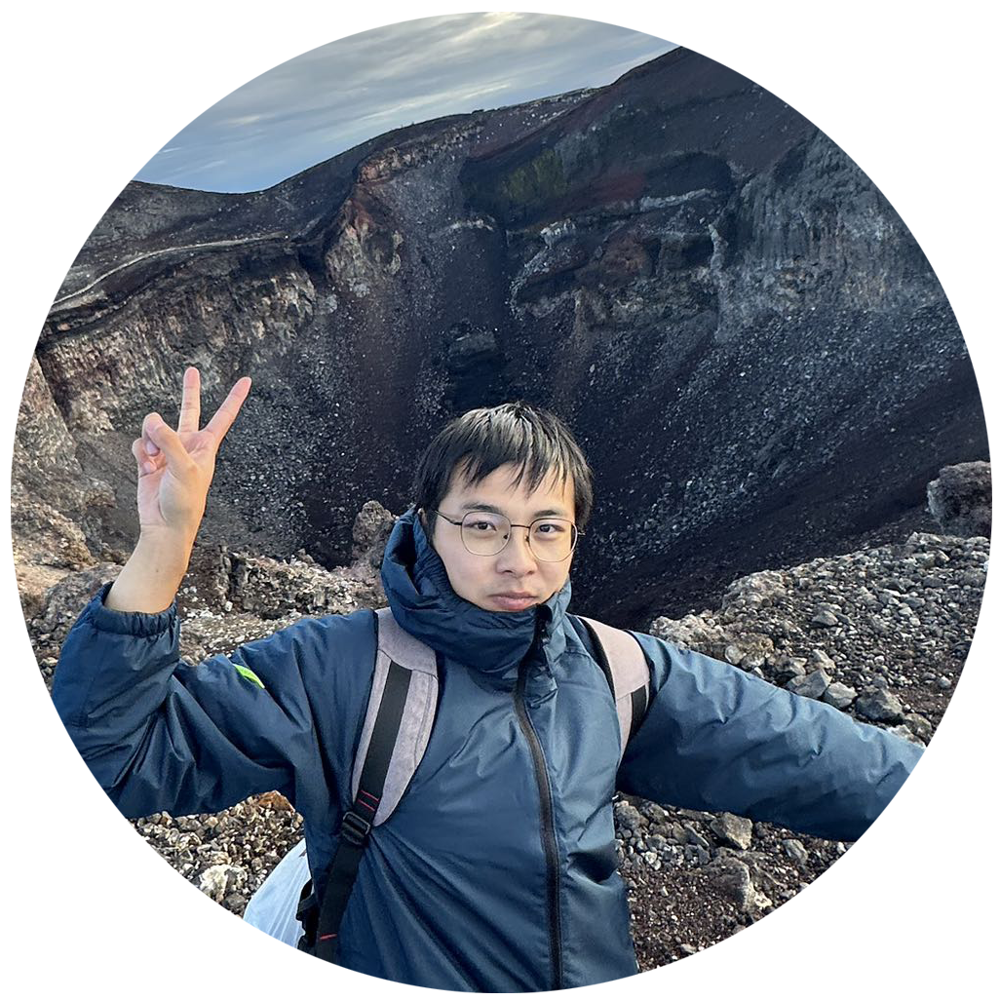

# Welcome to 黯然's Blog

    

        
        
    

    

        点我看看!
    

-   :material-heart:{ .lg .middle } __你可能感兴趣的__

    ---
    
    一些有用的文章（存疑）

    [:octicons-arrow-right-24: 去看看](./blog/index.md)

-   :material-emoticon-cool-outline:{ .lg .middle } __关于我__

    ---

    我是个...人？

    [:octicons-arrow-right-24: 了解一下](./about.md)

-   :material-foot-print:{ .lg .middle } __我的足迹__

    ---

    保持对这个世界的好奇心

    [:octicons-arrow-right-24: 施工中](#)

