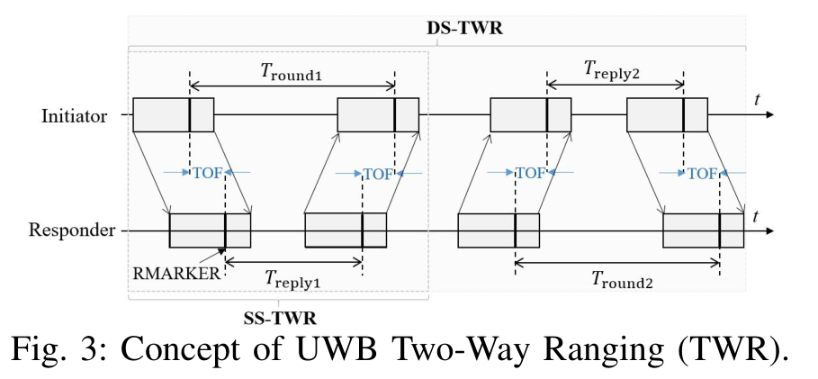
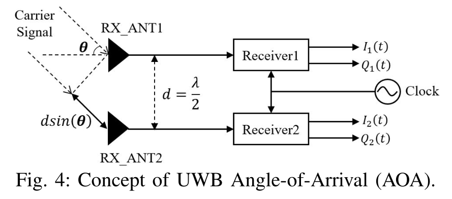
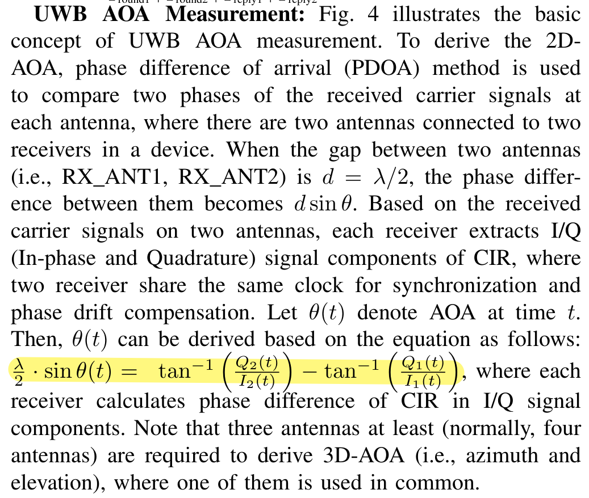

# UWB 与定位

相关论文：<https://ieeexplore.ieee.org/abstract/document/10622800>

## UWB Two-Way Ranging Measurement

参考：<https://zhuanlan.zhihu.com/p/693158281>

利用波的传输延迟差（光速）计算距离。

以上有两个公式：

$$
\left \{ 
\begin{aligned}
T_{round1} = 2TOF + T_{reply1} \\\\
T_{round2} = 2TOF + T_{reply2}
\end{aligned}
\right.
$$

注意，这里假设两次TOF是相同的。两边乘在一起：

$$
T_{\text {round } 1} \times T_{\text {round } 2}=4 \tau^{2}+2 \tau\left(T_{\text {reply } 1}+T_{\text {reply } 2}\right)+T_{\text {reply } 1} \times T_{\text {reply } 2}
$$

经过各种替换，得到：

$$\frac{T_{\mathrm{round}1}\cdot T_{\mathrm{round}2}-T_{\mathrm{reply}1}\cdot T_{\mathrm{reply}2}}{T_{\mathrm{round}1}+T_{\mathrm{round}2}+T_{\mathrm{reply}1}+T_{\mathrm{reply}2}}$$

## UWB AOA Measurement

参考：<https://blog.csdn.net/weixin_44555637/article/details/142935731>

远场入射的平行波，入射到距离间隔$d=\lambda /2$的两根天线，那么到达两个接收天线的信号具有相位差：

$$\triangle\phi=2*\pi*d*sin(\theta)/\lambda$$

这个相位差可通过[等效基带信号][1]提取的两对I/Q信号获得：

$$\triangle\phi=tan^{-1}\left(\frac{Q_2(t)}{I_2(t)}\right)-tan^{-1}\left(\frac{Q_1(t)}{I_1(t)}\right)$$

[1]: https://blog.csdn.net/weixin_39274659/article/details/110872154

由此可求得方位角如下：

$$\theta=arcsin(\triangle\phi/\pi)$$

!!! question "论文中的公式"

    参考论文中给出的UWB AOA方位角公式好像不太对：

    
