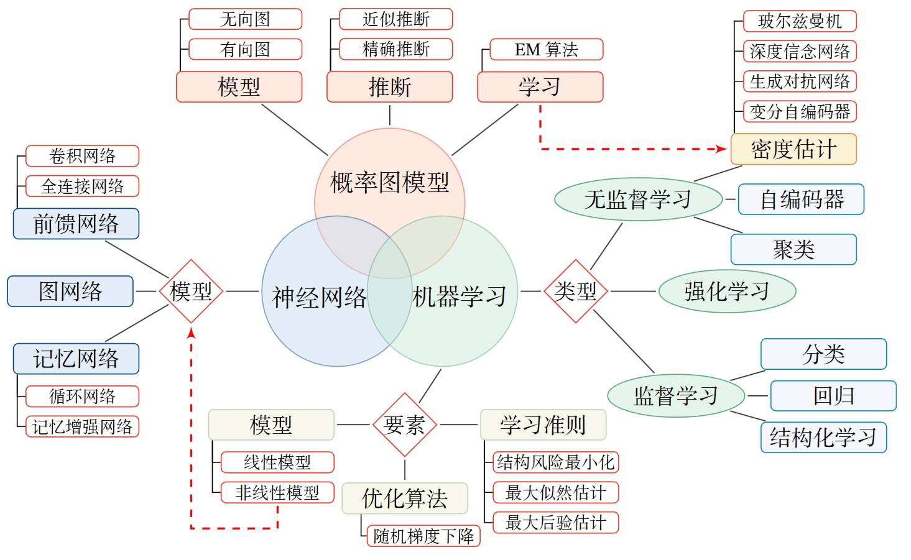
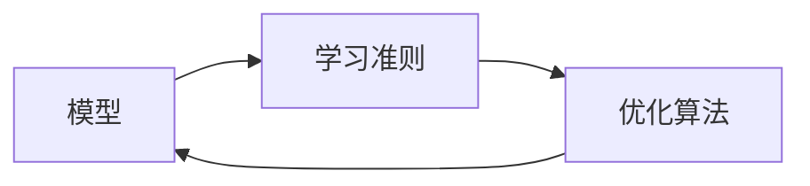
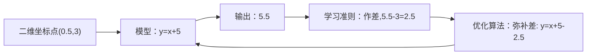
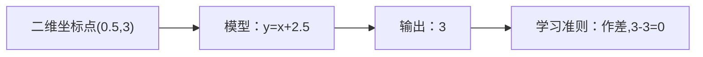

# 神经网络与深度学习

一些关于[《神经网络与深度学习》](https://nndl.github.io/)的笔记

- [优化算法](./opt_alg.md)
- [Python&代数](./python_algebra.md)

## 对神经网络与深度学习的理解

书中对整本书的结构如下，当不知道在学什么的时候，可以看一下这个图

- **神经网络**只是一个模型，就像函数一样，放进一个输入，给出一个输出，
只不过这个模型里包含很多首尾相接的函数，构成像神经一样的网络结构。
- **深度学习**其实就是反复学习的意思，什么是学习？学习就是试错，通过判断（分类）将事物和概念归类，
错了就修正，修正什么？修正模型中的参数。就像我们做错了，就会修正大脑里储存的认知一样。

对于人来说，上面两个过程通过大脑的神经网络和神经突触的敏感度的修正来实现。
但实际的生理过程要更为复杂。

!!! note
    知乎[关于人是怎么实现学习][label_1]的讨论，我觉得很有意义
    [label_1]: <https://www.zhihu.com/question/29192082>

## 简单引例

根据机器学习的三个基本要素：

- 模型：即“判断”或者“试错”的过程，延申出另外一个课题，模式识别。
- 学习准则：“试错”时与正确答案之间的差距
- 优化算法：如何对模型进行优化

我想了一个简单的例子，判断(0.5,3)在哪条斜率为1的线上

上面三个步骤展示三个基本要素的基本关系。但这里只用了一次学习就获得了最佳结果，
实际问题往往是需要多次学习来逼近真实模型的。

## 具体问题具体分析
